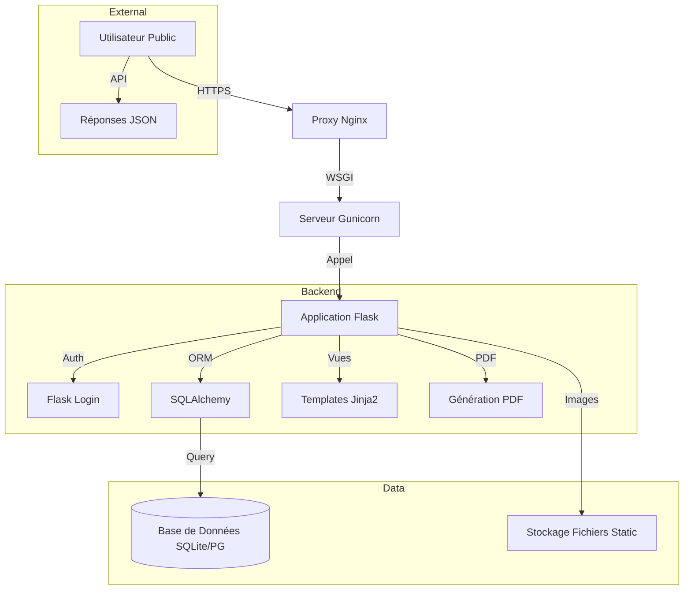

     

# [ 🇫🇷 Français ](README.md) | [ 🇬🇧 English ](README_en.md)

# Disparus Org - Plateforme de Recherche & Solidarité

**PROJET PRIVÉ & PROPRIÉTAIRE - MOA Digital Agency**

Disparus Org est une solution complète (Web & Mobile-Ready) dédiée à la gestion, la recherche et la diffusion d'alertes pour les personnes et animaux disparus. Elle intègre des outils avancés de géolocalisation, de génération de documents (PDF/Images) et un back-office d'administration robuste.

## Architecture



## Table des Matières
1.  [Fonctionnalités Clés](#fonctionnalités-clés)
2.  [Installation & Démarrage](#installation--démarrage)
3.  [Documentation Détaillée](#documentation-détaillée)

## Fonctionnalités Clés

### 1. Gestion des Disparitions (Disparus)
*   **Création de Profil :** Formulaire complet pour signaler une disparition (humain ou animal).
*   **Recherche et Filtres :** Recherche par mot-clé, filtres par statut/type/date, et tri par distance (géolocalisation).
*   **Affichage Détails :** Page dédiée avec informations, carte de localisation, et galerie photos.
*   **Mise à jour de Statut :** Gestion du cycle de vie (Disparu -> Retrouvé/Décédé).

### 2. Génération de Documents (PDF & Images)
*   **Affiches PDF :** Génération automatique d'affiches "Avis de Recherche" au format A4 avec QR code.
*   **Visuels Réseaux Sociaux :** Génération d'images optimisées (Carré/Paysage) avec thèmes visuels adaptés au statut.

### 3. Carte Interactive
*   **Affichage Global :** Carte montrant tous les signalements actifs avec clustering.
*   **Filtres Carte :** Interaction avec les filtres de recherche globaux.

### 4. Espace Administration
*   **Tableau de Bord :** Vue d'ensemble des statistiques.
*   **Gestion des Utilisateurs :** Liste, rôles (Admin/Modérateur/Utilisateur), bannissement.
*   **Modération des Contenus :** Validation/Rejet des signalements et commentaires.
*   **Logs d'Activité :** Historique des actions.
*   **Paramètres du Site :** Configuration globale sans redéploiement.

### 5. API Rest
*   **Endpoints Publics :** `GET /api/disparus` (Liste), `GET /api/disparus/<id>` (Détails).
*   **Endpoints Sécurisés :** Gestion via tokens ou session.

### 6. Sécurité & Conformité
*   **Authentification :** Login/Register sécurisé, hachage des mots de passe.
*   **Protection CSRF :** Sur tous les formulaires.
*   **Gestion des Droits :** RBAC complet.

### 7. Outils Divers
*   **Analytics :** Suivi des vues.
*   **Internationalisation (i18n) :** Support multilingue (FR/EN).

## Installation & Démarrage

### Pré-requis
*   Python 3.8+
*   pip

### Installation
1.  **Cloner le dépôt (Interne Uniquement) :**
    ```bash
    git clone <url-du-repo-prive>
    cd disparus-org
    ```
2.  **Créer un environnement virtuel :**
    ```bash
    python -m venv venv
    source venv/bin/activate  # Sur Windows: venv\Scripts\activate
    ```
3.  **Installer les dépendances :**
    ```bash
    pip install -r requirements.txt
    ```
4.  **Configurer l'environnement :**
    Créez un fichier `.env` à la racine :
    ```env
    SECRET_KEY=votre_cle_secrete
    DATABASE_URL=sqlite:///db.sqlite3
    ```
5.  **Initialiser la BDD :**
    ```bash
    flask db upgrade
    ```
6.  **Lancer le serveur :**
    ```bash
    flask run
    ```
    Accédez à `http://127.0.0.1:5000`.

## Documentation Détaillée
Toute la documentation technique et fonctionnelle se trouve dans le dossier `docs/`.

*   [🏗️ Architecture Technique](docs/disparus_org_architecture_technique.md)
*   [📘 Manuel Utilisateur](docs/disparus_org_guide_utilisateur.md)
*   [🛠️ Guide de Déploiement](docs/disparus_org_guide_deploiment.md)
*   [🔌 Référence API](docs/disparus_org_api_reference.md)

---
© 2024 MOA Digital Agency. Tous droits réservés. Code propriétaire.
