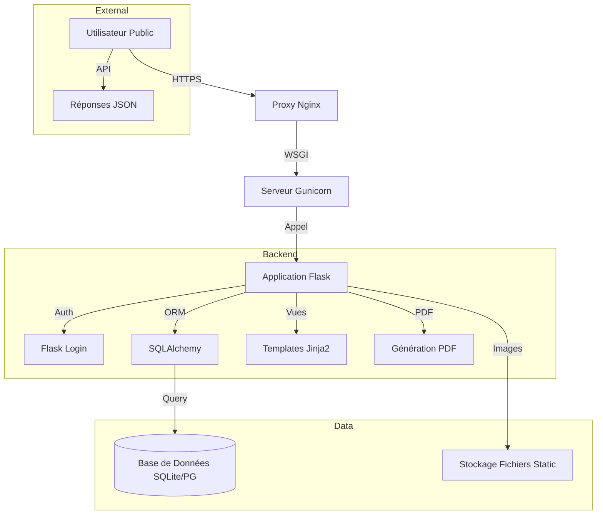

     

# [ 🇫🇷 Français ](README.md) | [ 🇬🇧 English ](README_en.md)

# Disparus Org - Plateforme de Recherche & Solidarité

**PROJET PRIVÉ & PROPRIÉTAIRE - MOA Digital Agency**

Disparus Org est une solution complète (Web & Mobile-Ready) dédiée à la gestion, la recherche et la diffusion d'alertes pour les personnes et animaux disparus. Elle intègre des outils avancés de géolocalisation, de génération de documents (PDF/Images) et un back-office d'administration robuste.

## Architecture



## Table des Matières
1.  [Fonctionnalités Clés](#fonctionnalités-clés)
2.  [Installation & Démarrage](#installation--démarrage)
3.  [Documentation Détaillée](#documentation-détaillée)

## Fonctionnalités Clés
*   **Signalements Complets :** Animaux et Humains, avec photos et géolocalisation précise.
*   **Recherche Intelligente :** Filtres par statut, date, et tri par distance.
*   **Génération de Documents :** Création automatique d'affiches PDF A4 et de visuels réseaux sociaux prêts à l'emploi.
*   **Administration :** Tableau de bord pour la modération des contenus et la gestion des utilisateurs.
*   **API REST :** Pour l'intégration avec des applications mobiles ou tierces.

## Installation & Démarrage

### Pré-requis
*   Python 3.8+
*   pip

### Installation
1.  **Cloner le dépôt (Interne Uniquement) :**
    ```bash
    git clone <url-du-repo-prive>
    cd disparus-org
    ```
2.  **Créer un environnement virtuel :**
    ```bash
    python -m venv venv
    source venv/bin/activate  # Sur Windows: venv\Scripts\activate
    ```
3.  **Installer les dépendances :**
    ```bash
    pip install -r requirements.txt
    ```
4.  **Configurer l'environnement :**
    Créez un fichier `.env` à la racine :
    ```env
    SECRET_KEY=votre_cle_secrete
    DATABASE_URL=sqlite:///db.sqlite3
    ```
5.  **Initialiser la BDD :**
    ```bash
    flask db upgrade
    ```
6.  **Lancer le serveur :**
    ```bash
    flask run
    ```
    Accédez à `http://127.0.0.1:5000`.

## Documentation Détaillée
Toute la documentation technique et fonctionnelle se trouve dans le dossier `docs/`.

*   [📜 Liste Complète des Fonctionnalités (Bible)](docs/disparus_org_features_full_list.md)
*   [🏗️ Architecture Technique](docs/disparus_org_technical_architecture.md)
*   [📘 Manuel Utilisateur](docs/disparus_org_user_manual.md)
*   [🔌 Référence API](docs/disparus_org_api_reference.md)

---
© 2024 MOA Digital Agency. Tous droits réservés. Code propriétaire.
