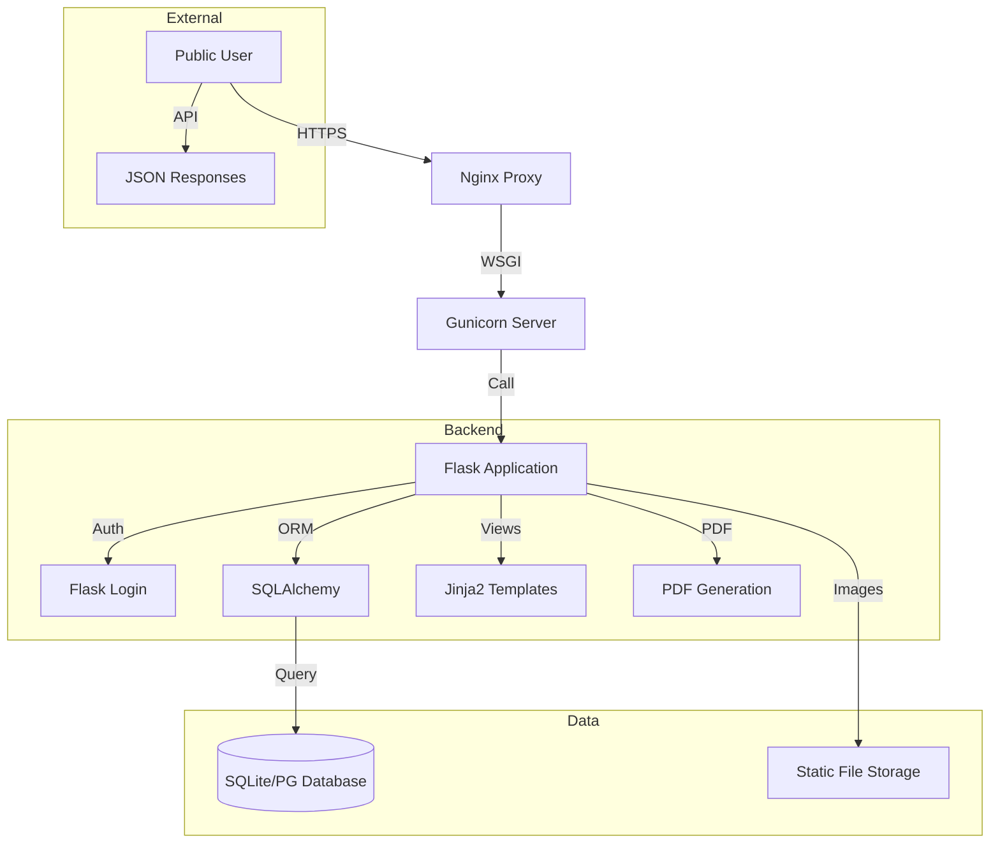

# [ 🇫🇷 Français ](README.md) | [ 🇬🇧 English ](README_en.md)

# Disparus Org - Search & Solidarity Platform

**PRIVATE & PROPRIETARY PROJECT - MOA Digital Agency**

Disparus Org is a comprehensive solution (Web & Mobile-Ready) dedicated to managing, searching, and broadcasting alerts for missing persons and animals. It integrates advanced geolocation tools, document generation (PDF/Images), and a robust administration back-office.

## Architecture



## Table of Contents
1.  [Key Features](#key-features)
2.  [Installation & Startup](#installation--startup)
3.  [Detailed Documentation](#detailed-documentation)

## Key Features
*   **Complete Reports:** Animals and Humans, with photos and precise geolocation.
*   **Smart Search:** Filters by status, date, and sort by distance.
*   **Document Generation:** Automatic creation of A4 PDF posters and social media visuals ready for use.
*   **Administration:** Dashboard for content moderation and user management.
*   **REST API:** For integration with mobile or third-party apps.

## Installation & Startup

### Prerequisites
*   Python 3.8+
*   pip

### Installation
1.  **Clone the repository (Internal Only):**
    ```bash
    git clone <private-repo-url>
    cd disparus-org
    ```
2.  **Create a virtual environment:**
    ```bash
    python -m venv venv
    source venv/bin/activate  # On Windows: venv\Scripts\activate
    ```
3.  **Install dependencies:**
    ```bash
    pip install -r requirements.txt
    ```
4.  **Configure environment:**
    Create a `.env` file at the root:
    ```env
    SECRET_KEY=your_secret_key
    DATABASE_URL=sqlite:///db.sqlite3
    ```
5.  **Initialize DB:**
    ```bash
    flask db upgrade
    ```
6.  **Start server:**
    ```bash
    flask run
    ```
    Access at `http://127.0.0.1:5000`.

## Detailed Documentation
All technical and functional documentation is located in the `docs/` folder.

*   [📜 Full Features List (Bible)](docs/disparus_org_features_full_list_en.md)
*   [🏗️ Technical Architecture](docs/disparus_org_technical_architecture_en.md)
*   [📘 User Manual](docs/disparus_org_user_manual_en.md)
*   [🔌 API Reference](docs/disparus_org_api_reference_en.md)

---
© 2024 MOA Digital Agency. All rights reserved. Proprietary code.
